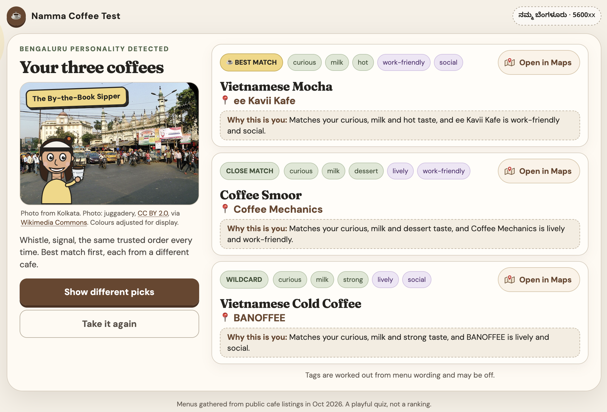

# Bengaluru Coffee Quiz

A short personality quiz that recommends **three specific coffees from three different Bengaluru cafes**, each with a reason, plus a database of **3,286 coffees across 227 popular cafes and chains** built mostly with free tools.

> **Status (2026-10-06):** the database, the tagging and the quiz app are built and tested (100 unit tests, about 190 browser tests on phone, tablet and desktop sizes, an exhaustive run over all 262,144 possible answer sets). The code is on GitHub (public) and the quiz is live on Vercel: **[bengaluru-coffee-test.vercel.app](https://bengaluru-coffee-test.vercel.app/)**. `REQUIREMENTS.md` is the source of truth for what the project does, `IMPLEMENTATION.md` for how it is built; this file does not repeat their rules.



## 1. About this project

This started as a fun little MVP questionnaire for **module 4.3, Build & Iterate (vibe coding)**, of the **Claude Code for PMs** course by **Carl Vellotti** ([Full Stack PM](https://fullstackpm.com), docs at [fullstackpm.com/docs](https://fullstackpm.com/docs), CLI at [fullstackpm.com/cli](https://fullstackpm.com/cli)). The lesson's version recommends one coffee type from a handful of personalities. I extended the scope on both sides: more cafes and more coffees on the data side, and more questions and richer matching on the quiz side.

The extension turned into a deep dive into **web scraping and data collection**: find the popular cafes in and around Bengaluru, read their menus, pull out every coffee, and describe each coffee and each cafe with a small fixed set of tags. The result is an extensive database of coffees across popular coffee shops and cafes in Bengaluru, which the quiz then matches people against.

## 2. The idea of the game

- **Nine questions**, three from each style: pop culture (Netflix, Hogwarts, movie genres), lifestyle (a Saturday morning, coffee in the Bengaluru weather, which Bengaluru moment is most you) and abstract (a colour, a desert-island item, how a friend describes you).
- Every answer adds points to **tags**. Coffee tags: strength, sweetness, milk, temperature, flavour, adventurousness. Cafe tags: vibe, crowd and setting.
- Every coffee in the database is scored by how well its tags (and its cafe's tags) match the person's points.
- The result is the **top 3 coffees from 3 different cafes**, best first, each with a one-line reason such as "Matches your strong and black taste, and Cafe X is quiet", and a Google Maps link for independent cafes (`Any` for chains).
- The look follows the reference page in `reference/`. The result page shows a Bengaluru scene (autos, traffic, rain, landmarks, tech parks, a window-seat view) chosen from your answers: a hand-picked photo from a curated pool of Creative Commons images (Openverse and Wikimedia Commons), credited under the photo, with a drawn caricature holding a coffee on top and a doodle loader while it loads. If a photo can't load a drawn scene appears instead. The photos are linked, not stored in this repo (66 are listed in `web/data/scene-photos.json`, credited in `design/image-credits.md`), and no photos of the cafes themselves are used. The quiz is designed for desktop web first and is compatible with mobile web. The design research is in `design/`.
- **How the picks are spread:** an exhaustive test of all 262,144 possible answer sets showed that the first version could only ever recommend 17.5% of the coffees and 56% of the cafes, with one cafe in a third of all quizzes. Scoring v2 (built) weights rare tags more, caps the cafe bonus, and draws the three picks from near-best bands with a seeded random generator: a best match, a close match and a wildcard. On all 262,144 possible answer sets it can now recommend 96% of the cafes and 61% of the coffees, and the most common cafe appears in 19% of quizzes (was 32%). A "Show different picks" button re-draws for the same answers. The page is designed for desktop first and is checked on phone, tablet and desktop sizes (no sideways scroll, 44 px tap targets, sticky Back/Next on phones, accessibility checks). The story and the numbers are in [`IMPLEMENTATION.md`](IMPLEMENTATION.md) section 4.
- Full rules: questions and answer weights in `REQUIREMENTS.md` section 5, scoring in `specs/scoring-spec.md`.

## 3. Building the game database

### 3.1 The goal: cheap and extensive

The aim was a database that is **wide** (hundreds of cafes, thousands of coffees, within 100 km of central Bengaluru) while costing **nothing in software**. That ruled out paid map and review APIs and led to a pipeline of open datasets, a local crawler, web search and AI sub-agents. The price was time, a lot of rough edges and some thin spots, all of which are listed below.

### 3.2 The pipeline, with numbers

| Stage | What happened | Result |
|---|---|---|
| 1. Universe | Pulled every cafe, restaurant, pub and bar within 100 km from OpenStreetMap and Overture Maps, merged them, deduplicated by name and distance, cleaned chain-name variants, then added four web sweeps of editorial lists for boutique places the datasets missed | 24,750 places |
| 2. Popularity | Scrolled about 180 Zomato and Swiggy listing pages, recording each place's position, rating and cuisines. Kept places rated 4.0 or higher that carry a cafe, coffee or brewery tag | 381 places (358 independent, 23 chains) |
| 3. Menus | Read each place's menu for its coffee items. Pass 1: 13 agents on Zomato order pages. Pass 2: 6 agents on the places that failed, using the cafe's own site, Swiggy, EazyDiner, district.in, PDF menus and menu photos | 3,300 coffees from 228 places, then 3,286 from 227 after cleaning |
| 4. Coffee tags | A written rubric and 8 agents tagged every coffee: strength, sweetness, milk, temperature, flavour, adventurousness. Each tag is marked *stated* (the text says it) or *inferred*; blank beats a guess | `data/coffee_database.csv` |
| 5. Cafe tags | Web research for each cafe's vibe and crowd, plus whether it is a specialty or experimental cafe. A second, generic-search pass filled the gaps, then menu-derived facts filled what the web could not | vibe on 216 of 227 cafes, crowd on 68 |
| 6. Bold rule | A coffee with a twist (spiced, fruity or nutty flavour, a tonic or infusion) at a specialty or experimental cafe becomes `bold` | 14% of coffees |

Rules and decisions behind each stage are in `REQUIREMENTS.md`. Tagging details are in `specs/tagging-rubric.md`.

### 3.3 What we used

| Need | Tool |
|---|---|
| Cafe and restaurant locations | OpenStreetMap Overpass API (free) and Overture Maps Places (free, read from S3 with DuckDB) |
| Crawling | [Crawl4AI](https://github.com/unclecode/crawl4ai) driving the Google Chrome already on the machine |
| Popularity signal | Zomato and Swiggy listing pages (position, rating, cuisines) |
| Finding cafe descriptions and reviews | Web search and page fetch, run by AI sub-agents |
| PDF and photo menus | PyMuPDF to read PDFs and render pages, then reading the images directly |
| Data work | Python 3.12 scripts in `data/` and `crawl/`, plain CSV and JSON files |
| Parallel work | Claude Code sub-agents, one per batch of about 20 to 30 cafes, each writing its own output file |

### 3.4 Iteration techniques that worked

- **Write the spec first and keep it current.** Every decision was logged with its reason in `REQUIREMENTS.md`, and the code followed it.
- **Change the bar when the data changes what you can measure.** The popularity filter went from "1,000 Google reviews" to "300 reviews across three sites" to "average of two sites above 500", and finally to **popularity rank plus rating**, which can be measured for free and still keeps well-known places and promising newcomers.
- **Pilot before you scale.** A 10-cafe pilot caught a dead route (Google Maps pages return an empty shell) and a dead budget before a 12-agent run.
- **Parallel agents with files per batch.** Each agent reads one batch file and writes one output file and a status line per cafe, so a failure loses one batch, not the run. Agents write each row as they go.
- **A second pass for failures.** Zomato's order pages gave coffee menus for most cafes. The ones that did not were retried through other sources, including reading menu photos.
- **Calibrate every heuristic against ground truth.** The menu-text rules for cafe vibe were tested against the web-backed tags. Most failed (one agreed 7% of the time) and were not shipped. Only the ones above about 70% were kept.
- **Tune thresholds by measuring the effect.** The Bold rule first made 29% of coffees bold, then 20%, then 14% after the weakest case (plain strong drinks) was removed.
- **Prefer blank to wrong.** Every tag carries a basis, and unknown stays blank. The reason line in the quiz is built only from tags that actually matched.
- **Review samples and backups.** A random 50-row sample of the tags was read by a human before the build, and every merge kept a backup of the previous database (those backups have since been deleted).

### 3.5 Problems we hit (so you don't)

- **The network's IPv6 route was dead** for some hosts, so scripts force IPv4.
- **The crawler's own browser download failed**, so it uses the installed Chrome.
- **Overpass rejects requests without a descriptive User-Agent** (HTTP 406).
- **The web search budget is fixed per session** by `CLAUDE_CODE_MAX_WEB_SEARCHES_PER_SESSION` and is shared by every agent. A first vibe pass failed because it was already spent. Raising it elsewhere does not change a running session.
- **Parallel searches trip a rate limit** (`too_many_requests`). The fix was one search at a time, a pause between calls and a retry with a longer wait.
- **Zomato rate-limits** (HTTP 429) when many agents read it together.
- **The Foursquare open dataset** was no longer openly available when I tried it, so it was skipped.
- **Names collide.** Several searches returned a different venue with a similar name, and agents were told to leave tags blank when that happened.

### 3.6 Data quality, honestly

- Ratings and popularity come from Zomato and Swiggy listings, not Google. Position on a Zomato listing depends on Zomato's default sort, which the page marks as popularity.
- **Prices were collected and then dropped** from the project by choice. The raw prices were mostly delivery prices and differ from in-cafe prices.
- About 30% of coffees have no menu description, so their tags rest on the name alone.
- **Cafe vibe and crowd are the weakest tags.** Vibe covers 95% of cafes, but crowd covers 30%, and most vibe tags are marked inferred.
- 11 cafes have no vibe tag because no source about that specific venue was found. Their coffees are fully tagged.
- 38 shortlisted places had no readable menu and are not in the database. Many cafes have image-only or dine-in-only menus.
- **Terms of service.** Zomato, Swiggy and other sites restrict scraping. This was done slowly and for a personal, non-commercial course project, and this repository is public by my choice. Full attribution and methods are in section 7. Do not use the data commercially without checking each source's terms.
- The data is a snapshot from October 2026. Menus change.

### 3.7 The ideal way, if you had a budget: Google Places API

With money to spend, the strongest backbone is the **Google Places API (New)**, and it would replace most of stages 1, 2 and 5:

- **Discovery with exact review counts.** Text Search and Nearby Search return place ID, name, address, coordinates, rating, `userRatingCount`, types, website and an official Maps link. That makes the original rule, cafes with 1,000 or more Google reviews, a one-line filter, and the Maps links become real place links, not search links.
- **Cafe description and attributes.** Places data includes editorial summaries, a sample of reviews and yes/no attributes such as serves coffee, live music, outdoor seating and good for groups. That is much closer to what the vibe pass was reconstructing from blogs. Check the current field list before building on it.
- **A stable ID for deduplication.** The place ID replaces the name-and-distance matching, and fixes chain outlets and name collisions.
- **Things to plan for:** results per query are capped (about 60), so the 100 km area must be tiled into a grid and searched by type; billing is per request and depends on which fields you ask for, with free monthly allowances that change, so run a small area first and extrapolate; and the terms restrict how long Places content can be stored, so check them (place IDs are the long-lived part).
- **What it does not give you:** menus. You would still need the menu crawl (own sites, delivery platforms, photos) or a paid menu data source.

A reasonable budget-tier pipeline: Places API for the universe, review filter and cafe attributes; the crawler plus agents for menus; the same rubric for tagging. Google review text could also feed the crowd and vibe tags directly.

## 4. Repository map

| Path | What is in it |
|---|---|
| `REQUIREMENTS.md` | The spec (PRD): scope, data rules, quiz questions, scoring, phases, decisions |
| `specs/` | `tagging-rubric.md` (how tags are assigned) and `scoring-spec.md` (how answers become a result, with worked examples) |
| `data/coffee_database.csv` | **The final database**: one row per coffee, with all tags and its cafe's tags |
| `data/cafe_tags.csv`, `data/cafe_evidence.csv` | Cafe-level tags, and the evidence and source links behind them |
| `data/popular_shortlist.csv` | The 381-place shortlist with Maps links. (`data/universe.csv`, the list of all 24,750 places, stays on my machine and is not in the GitHub repo.) |
| `data/tagging/review_sample.md` | The 50-row sample of tags that was reviewed by hand |
| `archive/pipeline-intermediates.zip` | (local only, not in the GitHub repo) 134 working files, zipped: the agents' input batches and outputs, the per-batch menu coffee rows, the tagging scripts with their hand overrides, and the pre-tag coffee list. Unzip at the project root to restore them to their original paths |
| `data/quiz_data.json` | The database packed for the app (cafes once, coffees pointing at them); made by `data/export_for_app.py` |
| `data/*.py`, `crawl/*.py` | The pipeline scripts, one per step (see below) |
| `web/` | The quiz app (Next.js). `web/lib` holds scoring and scene logic, `web/data/scene-photos.json` the approved photo references, `web/tests` and `web/e2e` the tests |
| `scripts/` | Photo tools: `find_photos.py` (search Commons), `preselect.py` (rank and build review sheets), `build_shortlist.py` (data file, credits, review page). `scripts/out/` is scratch and not in the repo |
| `reference/`, `design/` | The page style to match, and Bengaluru design and caricature research for the result page |

Large raw pulls and crawled pages were deleted after use and can be regenerated with the scripts below. The agents' working files are kept in the zip above, not as loose files.

## 5. Running it

**The quiz app** (in `web/`, Next.js):

```
cd web
npm install
npm run dev                     # http://localhost:3000
```

No keys or accounts are needed. Tests: `npm test` (fast unit and data tests), `npm run test:coverage` (every one of the 262,144 answer combinations against the real database, about 2 minutes, writes `web/test-results/coverage.md`), `npm run test:e2e` (browser tests on phone, tablet and desktop sizes, using installed Google Chrome) and `npm run test:all`. The test plan is in `REQUIREMENTS.md` section 10.

**The database** is built by these scripts, which were run in roughly this order, with the sub-agent steps in between (menu reading, tagging, vibe research):

```
python3.12 -m venv .venv-crawl && .venv-crawl/bin/pip install crawl4ai pymupdf duckdb   # needs Google Chrome installed
curl ... data/osm_query.overpassql  (with a User-Agent)  ->  data/overture_pull.py  ->  data/build_universe.py
data/clean_chains.py  ->  data/merge_editorial.py  ->  data/dedupe_editorial.py
crawl/harvest.py  ->  data/build_cut.py                                   # popularity shortlist
data/merge_menus.py  ->  data/merge_tags.py                               # coffee rows, then tags
data/derive_cafe_facts.py  ->  data/menu_signals.py  ->  data/merge_vibe.py  ->  data/build_review_sample.py
```

- The data scripts print their own checks: vocabulary errors, basis mismatches, row counts and coverage. The app's automated tests are described in `REQUIREMENTS.md` section 10.
- The raw inputs were deleted and the working files are zipped, so re-running a step means re-pulling the raw data and, for the merge steps, unzipping `archive/pipeline-intermediates.zip` at the project root first. `merge_vibe.py` and `build_review_sample.py` also read a pre-vibe copy of the database that no longer exists; regenerate it with `merge_tags.py` before re-running them.
- Web steps need a web search budget and a rate-aware approach (see 3.5).

## 6. What is next

1. Deployed on Vercel (lesson 4.5) on 2026-10-06; the course path and its small differences are in `REQUIREMENTS.md` section 0. Vercel is connected to the GitHub repo (Root Directory `web`), so every push to `main` deploys automatically.
2. Further iteration on the app (phases in `REQUIREMENTS.md` section 9), then the detailed caricature set.

## 7. Declarations: sources, attribution and methods

This is a personal, non-commercial learning project, published openly as a portfolio piece. It is not affiliated with, endorsed by or sponsored by any business, platform or dataset named below. All names, trademarks and menu content belong to their owners.

### 7.1 Data sources and attribution

| Source | What it was used for | Attribution and terms |
|---|---|---|
| [OpenStreetMap](https://www.openstreetmap.org), via the Overpass API | Locations of cafes, restaurants, pubs and bars within 100 km | © OpenStreetMap contributors, data under the [Open Database Licence (ODbL)](https://www.openstreetmap.org/copyright). The merged list of all places is kept locally, not in this repo |
| [Overture Maps Foundation](https://overturemaps.org), Places theme, release 2026-09-23.1 | Locations and categories of places | Used under Overture's licence; see [Overture's attribution page](https://docs.overturemaps.org/attribution) for the exact terms |
| Zomato and Swiggy listing pages | Popularity (position on listings), ratings and cuisines; menu pages (including photos) for coffee items | Public pages read by an automated crawler. These sites' terms restrict automated access and reuse. Collected slowly, with delays and retries, for non-commercial learning. Their content remains theirs |
| EazyDiner, district.in, Justdial, Tripadvisor, magicpin, Swiggy Dineout | Menu photos and listing text for cafes that had no usable menu elsewhere; ratings and descriptions in search snippets | Public pages, same conditions as above |
| Cafe and brand websites, blogs and press (for example LBB, Time Out, Condé Nast Traveller, Eater and similar lists) | Menus, About text, atmosphere and review excerpts, found through ordinary web search | Public pages. Evidence is paraphrased in `data/cafe_evidence.csv`, with the source URL beside each entry |
| Google search results | Finding the pages above, and generating Maps *search* links from cafe name and area | No Google Maps pages or Google review data were scraped. Ratings in the evidence file come from the platforms named there, not from Google |

### 7.2 Tools and licences

[Crawl4AI](https://github.com/unclecode/crawl4ai) (Apache-2.0) and Google Chrome for crawling; [PyMuPDF](https://pymupdf.readthedocs.io) (AGPL-3.0, used only as a local tool to read PDFs, not distributed here); [DuckDB](https://duckdb.org) (MIT) to read Overture; Python 3.12; [Claude Code](https://claude.com/claude-code) and its sub-agents (Anthropic) for much of the research, reading and tagging; Next.js for the quiz app; Vitest and Playwright for tests. The project follows the [Claude Code for PMs](https://fullstackpm.com) course by Carl Vellotti.

### 7.2a Images in the quiz app

The scene photos on the result page are hand-picked from [Openverse](https://openverse.org) and [Wikimedia Commons](https://commons.wikimedia.org) and used under their Creative Commons or public-domain licences (CC0, CC BY, CC BY-SA). Each photo is shown with its author, licence and a link to the source, and the full list is in [`design/image-credits.md`](design/image-credits.md) (added when the set is approved). The photos are loaded from their original servers and are not stored in this repository; they belong to their photographers. The caricature, the loader and the fallback scenes are drawn for this project. No photos of the cafes themselves are used, Pinterest is not used, and no photo sites are scraped (Openverse and Commons are read through their public APIs).

### 7.3 Methods declaration

- **Collection.** Automated and agent-assisted: open datasets for locations, a local crawler for listing and menu pages, web search for descriptions, and AI agents to read menus, including menu photos and PDFs, which they transcribed by eye. No logins, no paywall bypassing and no Google Maps scraping. Requests were paced and retried politely.
- **Tagging.** Written rules (`specs/tagging-rubric.md`) applied by AI agents and scripts. Every tag is marked *stated* (the source says it) or *inferred*. Where a source gave no evidence the tag is left blank, not guessed. A random 50-row sample was checked by hand.
- **Known errors.** The data is a snapshot from October 2026. Menus, prices and opening status change, and some venues may have closed. AI reading of images and text can be wrong. Prices were deliberately left out.
- **Thresholds I chose.** Popularity cut (rating 4.0 or higher on listing pages), the Bold-coffee rule and the menu-derived cafe facts are my own judgement calls, documented in `REQUIREMENTS.md` and `specs/`.
- **AI assistance.** Large parts of this project were written and run by AI agents under my direction. I reviewed the decisions and the sample but not every row.

### 7.4 Removal requests

If you own a business or a source listed here and want something removed or corrected, open an issue on this repository and it will be taken down promptly.

## 8. Licence

- **Code** (the Python scripts in `data/`, `crawl/` and `scripts/`, and the quiz app in `web/`) is under the [MIT Licence](LICENSE).
- **Data** (`data/*.csv`, `data/quiz_data.json`, `web/public/quiz_data.json`) is **not** covered by the MIT licence. It was compiled from the sources in section 7.1 and remains subject to their terms. In particular, locations derived from OpenStreetMap are under the [ODbL](https://www.openstreetmap.org/copyright) and need the attribution "© OpenStreetMap contributors", and menu and listing content belongs to the venues and platforms. It is shared for learning and non-commercial use only; check each source's terms before any other use.
- **Photos** shown in the app are linked, not stored, and keep their own Creative Commons licences and credits (`design/image-credits.md`).
- **Written documents and design notes** (`REQUIREMENTS.md`, `IMPLEMENTATION.md`, `specs/`, `design/`) are shared for reading and learning; please credit this project if you reuse them.

## 9. Documents

- Spec (PRD): [`REQUIREMENTS.md`](REQUIREMENTS.md)
- Implementation (how it is built, and how we found and fixed the coverage blocker): [`IMPLEMENTATION.md`](IMPLEMENTATION.md)
- Tagging: [`specs/tagging-rubric.md`](specs/tagging-rubric.md) and scoring: [`specs/scoring-spec.md`](specs/scoring-spec.md)
- Scenes and the photo-selection rules: [`specs/scene-spec.md`](specs/scene-spec.md)
- Design research: [`design/bengaluru-design-inspiration.md`](design/bengaluru-design-inspiration.md); caricature and photo-source notes, the photo shortlist and the credits are added to `design/` in phase 10.3
